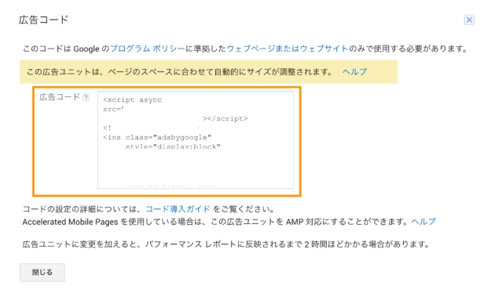

参考：https://support.google.com/adsense/answer/9261307?visit_id=639060204740155062-3815646975&rd=1


サイトに全部のってたか。

1. Googleアドセンス側での広告コードの取得
2. Googleアドセンスにアクセスし、お持ちのGoogleアカウントでログインしてください。
3. 「広告の設定」から「自動広告」のページに移動してください 。
4. 画面上に「使ってみる」ボタンが表示されたら、クリックしてください。
4. 「グローバル設定の選択」ページに移動したら、表示する広告フォーマットを選択し、「保存」ボタンを押してください。
5. 「広告コード」が表示されたら、コードをコピーしてください。


さらに詳しく知りたい方は、下記のGoogleアドセンスの公式ヘルプを参照してください。


```
<script async src="https://pagead2.googlesyndication.com/pagead/js/adsbygoogle.js?client=ca-pub-3989656320273113"
     crossorigin="anonymous"></script>
```


## 広告が出されすぎ

Google AdSense合格おめでとうございます！収益化の第一歩ですね。

広告が表示されすぎる原因のほとんどは、Googleにお任せで広告を配置する**「自動広告」**の設定にあります。これを調整することで、ユーザーにとって読みやすい「適度な量」にコントロールできます。

以下の3つのステップで設定を見直してみてください。

---

### 1. 広告の「読み込み量」を制限する

Google AdSenseの管理画面で、表示される広告の密度を直接下げることができます。

1. AdSense管理画面で **[広告] > [サマリー]** を開く。
2. 編集したいサイトの横にある **[編集（鉛筆マーク）]** をクリック。
3. 右側のメニューにある **[広告の読み込み量]** スライダーを左（最小方向）に動かす。
4. **[サイトに適用]** をクリック。

> **ポイント:** これにより、ページ内の記事の長さに対して広告が詰め込まれすぎるのを防げます。

### 2. 特定の広告フォーマットをオフにする

特に「表示されすぎ」と感じさせるのは、画面を覆い尽くすタイプの広告です。これらを個別にオフにできます。

* **アンカー広告**: 画面の上下に張り付く広告。
* **全画面広告（モバイル全画面広告）**: ページ遷移時に画面全体に出る広告。

これらは先ほどの編集画面の **[広告フォーマット]** セクションでスイッチをオフにできます。

### 3. 「広告設定のプレビュー」で場所を削除する

自動広告が「ここには出してほしくない（例：メニューのすぐ下など）」という場所に表示されている場合、個別に削除できます。

1. 広告設定のプレビュー画面（ステップ1の編集画面）で、ページ上の広告にマウスを合わせる。
2. ゴミ箱アイコン **[削除]** をクリック。
3. その場所には今後広告が出なくなります。

---

### ネットワークエンジニア・ブロガーとしてのTips

ブログで技術記事（ネットワーク関係など）を書かれている場合、**「コードブロック」の前後や図解のすぐ下**に広告が入り込むと、読者が情報を読み取りにくくなってしまいます。

* **手動広告への切り替え**: 自動広告を最小限にするかオフにして、自分で「記事の最初・中間・最後」の3箇所だけに広告コードを貼る**手動配置**に切り替えると、デザインを完全にコントロールできます。
* **ユーザー体験（UX）の優先**: はてなブログなどの場合、標準の広告設定とGoogleの自動広告が重複して重なっているケースもあります。一度、シークレットブラウザで自分のブログを確認し、「自分が読者ならどこまで許容できるか」をチェックしてみるのがおすすめです。

次は、**「特定の場所（特定の記事など）だけ広告を非表示にする設定方法」**や、**「クリックされやすい効果的な広告位置」**について詳しくお伝えしましょうか？
